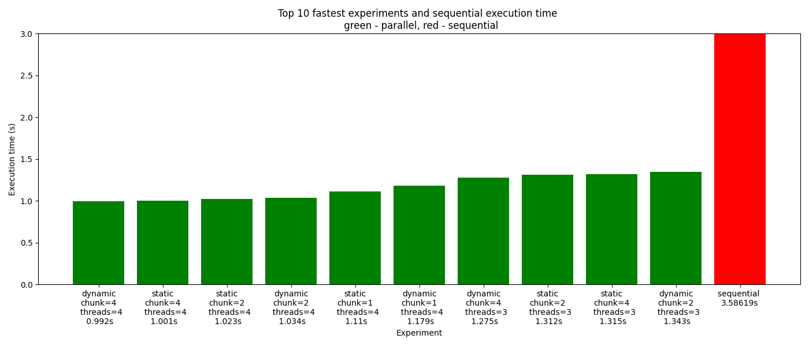
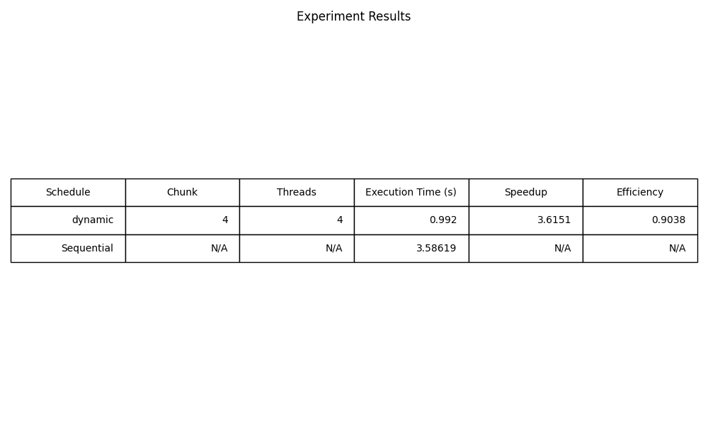

# openmp-test-automator 🚀

This script automates the testing of OpenMP parallelization configurations for C++ code. It conducts experiments with different scheduling strategies, chunk sizes, and thread numbers to evaluate performance. Here's how it works:

## Dependencies 🛠️ ⚠️⚠️⚠️
### The Code Will Not Work Without These Dependencies
- `g++`: for compiling C++ code
- `matplotlib`: for plotting results (`pip install matplotlib`)
- `pandas`: for data manipulation (`pip install pandas`)
- convert the schedule type in the parallel code to **runtime** to use the environment variable for scheduling
- **don't** set the thread number in the code, it'll be set by the environment variable

## How It Works ℹ️

1. **Compile Code**: The script compiles both parallel and sequential C++ codes using `g++`.
2. **Run Experiments**: It conducts experiments by varying scheduling, chunk sizes, and thread numbers, utilizing environment variables for configuration.
3. **Generate Data**: Results are stored in CSV files (`experiments.csv` and `best.csv`) containing experiment details and the best configurations.
4. **Plot Results**: The script visualizes experiment results, comparing parallel execution times with the sequential baseline.

## Files Generated 📄

- `output.txt`: Captures program output.
- `experiments.csv`: Stores experiment details.
- `best.csv`: Contains the best configurations found.

## Environment Variables ⚙️

- `OMP_SCHEDULE`: Set the scheduling strategy and chunk size.
- `OMP_NUM_THREADS`: Set the number of threads.

## How to Use 📝

1. Set environment variables for scheduling, chunk size, and thread number.
2. Run the script.
3. View generated plots (`plot1.png` and `plot2.png`) for performance comparisons.

Feel free to explore and tweak the script to optimize OpenMP configurations for your parallel programs! 🚀📊
